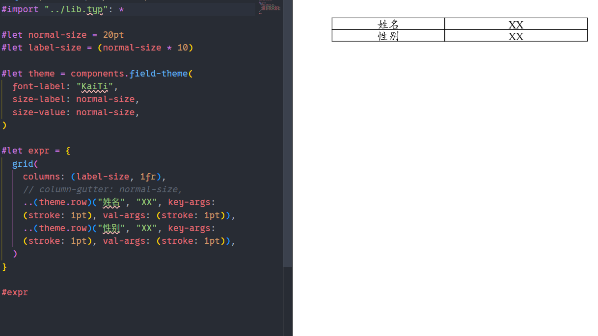

<div style="text-align: center;">

# zh-draft

</div>

**`CN-Kit`** is a tool-kit containing several components and utilities for `typst`. You should refer to [Typst Docs](https://typst.app/docs/) if you don't know it. It's suitable for those struggling on format of thesis in China. However, it's adaptable for anyone if it **aids** you.

## Introduction

Currently, it contains only few things in [`components.typ`](components.typ) only about grid tables.

Here the handy case:



_Waiting for improvement..._

## Usage

Currently, it's not adaptable on [Typst Universe](https://typst.app/universe/). I will publish it until it's mature or never due to violation of certain criteria.

```shell
git clone <repo> <path>
```

```typst
#import "<path to package>/lib.typ": *
```

## License

[MIT License](LICENCE)